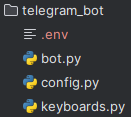
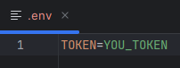
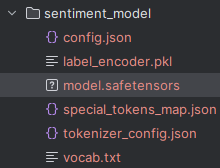
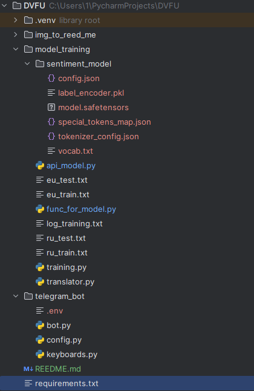

# **Настройка бота и функционал**

## Добавление токена бота .env файла

Создайте файл '.env' в директории telegram_bot

Добавьте свой токен telegram в переменную "TOKEN"

## Добавление модели, чтобы не тренировать её

Скачать модель нужно тут - https://disk.yandex.ru/d/xiv2M3o7rVKpZQ

Скаченную папку sentiment_model нужно закинуть в директорию model_training

##### **Архитектура модели -**

## Установка библиотек

pip install -r requirements.txt

## Описание программы:

read_me: Файл с картинками для README.md.

model_training: Папка, содержащая файлы, связанные с обучением модели.

sentiment_model: Готовая модель для анализа настроений (sentiment analysis).

api_model.py: Скрипт для работы использования модели, получения обработанного ответа от нее

eu_test.txt: Датасет на англ языке для теста модели.

eu_train.txt: Обучающий датасет на англ языке.

func_for_model.py: Основные функции для работы с моделью.

log_training.txt: Лог-файл показывающий результат обучения модели.

ru_test.txt: Датасет на русском языке для теста модели.

ru_train.txt: Обучающий датасет на русском языке.

training.py: Скрипт для обучения модели.

translator.py: Скрипт для перевода датасетов.

telegram_bot: Папка, содержащая файлы для телеграм-бота.

env: Файл или папка с переменными окружения.

bot.py: Основной скрипт для телеграм-бота.

config.py: Конфигурационный файл для бота.

keyboards.py: Скрипт для создания клавиатур в телеграм-боте.

requirements.txt: Файл с зависимостями проекта.

## Итоговая архитектура проекта:

